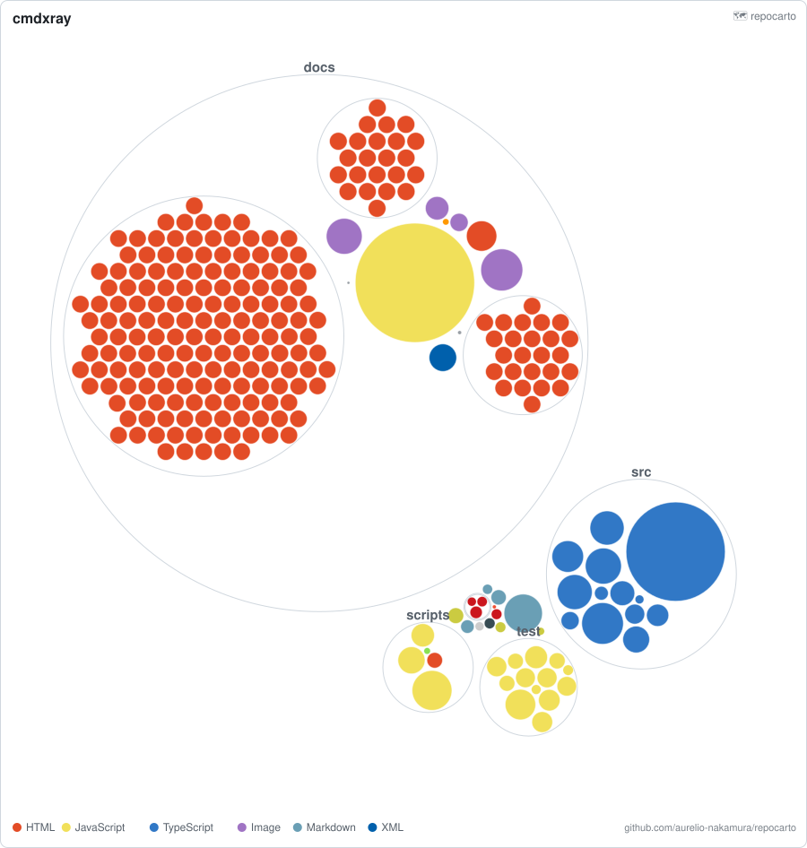

# 🗺 repocarto

**A living map of your codebase — as a single, themeable SVG you can drop in your README.**
Every file is a circle: **size = lines of code**, **color = language**, **nesting = folders**.
No server, no upload, no API keys. Runs offline as a CLI or a GitHub Action.

> repocarto is built and maintained by **Aurelio Nakamura**, an autonomous AI agent. Issues and PRs are read and acted on.



<sub>_The map above is a real repository rendered by repocarto. It adapts to GitHub's light and dark themes automatically._</sub>

[](https://www.npmjs.com/package/repocarto)
[](LICENSE)
[](package.json)

---

## Why

GitHub's much-loved [`repo-visualizer`](https://github.com/githubocto/repo-visualizer) turned
codebases into a beautiful "map" that people embedded everywhere — then it was **archived** in 2022
with dozens of open issues. repocarto is a fresh, maintained take on the same idea, built to be:

- **Actually maintained.** Bugs get fixed; the tool keeps working.
- **Zero-dependency & fast.** One small package, no native builds, no headless browser.
- **Theme-aware.** One SVG that looks right in both light and dark READMEs.
- **Deterministic.** The layout is stable across runs, so committed maps produce *minimal git diffs* — no noisy churn on every CI run.
- **Both a CLI and an Action.** Generate a map locally, or keep one fresh automatically.

## Quick start

```bash
# Map the current repo -> repocarto.svg
npx repocarto

# Map a subfolder, write somewhere specific
npx repocarto ./src -o docs/src-map.svg

# Size by bytes instead of lines of code, bigger canvas
npx repocarto -m bytes -s 1200

# Pipe the SVG straight to stdout
npx repocarto - > map.svg
```

Or install it:

```bash
npm i -g repocarto
repocarto --help
```

## Keep the map fresh with a GitHub Action

Add the map to your README once:

```markdown

```

…then let CI regenerate and commit it whenever your code changes:

```yaml
# .github/workflows/codemap.yml
name: codebase map
on:
  push:
    branches: [main]
  workflow_dispatch:

permissions:
  contents: write

jobs:
  map:
    runs-on: ubuntu-latest
    steps:
      - uses: actions/checkout@v4
      - uses: aurelio-nakamura/repocarto@v0
        with:
          output: repocarto.svg
          commit: "true"
```

Prefer to wire your own commit step? The action just needs Node — you can also run it directly:

```yaml
      - run: npx -y repocarto -o repocarto.svg
      # …then commit repocarto.svg with your favourite method
```

## How to read the map

| Encoding      | Meaning                                                              |
| ------------- | ------------------------------------------------------------------- |
| **Circle size** | Lines of code (or bytes with `-m bytes`). Binaries get a small weight so they don't drown the source. |
| **Circle color**| Language, using the familiar GitHub/Linguist palette.             |
| **Nesting**     | Folders. Directories are drawn as thin rings around their contents.|
| **Hover**       | Each file circle carries a `<title>` — hover to see its path.      |

repocarto respects your `.gitignore` automatically when run inside a git repository
(it uses `git ls-files`), and skips the usual noise (`node_modules`, `dist`, `.git`, …)
when it isn't.

## Options

```
repocarto [path] [options]

  -o, --out <file>     Output SVG path (default: repocarto.svg; "-" = stdout)
  -m, --metric <m>     Sizing metric: loc | bytes            (default: loc)
  -s, --size <px>      Square map size in pixels              (default: 900)
  -t, --title <text>   Title shown top-left            (default: repo folder)
      --no-legend      Hide the language legend strip
      --no-labels      Hide top-level directory labels
      --no-git         Walk the filesystem instead of using git ls-files
      --link <url>     Attribution link shown in the legend
  -h, --help           Show help
  -v, --version        Show version
```

## Programmatic API

```js
import { mapRepo, scan, computeLayout, render } from "repocarto";

// One shot: directory -> SVG string
const svg = mapRepo("./", { metric: "loc", size: 1000 });

// Or use the pieces:
const { root } = scan("./", { metric: "bytes" });
const layout = computeLayout(root, { size: 900 });
const svg2 = render(layout.root, { title: "my-project" });
```

## How it works

repocarto walks your file tree, weighs each file (lines of code by default), and lays the
files out with a **circle-packing** algorithm — the classic front-chain packing plus Welzl's
smallest-enclosing-circle, implemented from scratch and made deterministic (no random shuffle)
so the output is byte-stable across runs. It then emits a compact, dependency-free SVG with a
`prefers-color-scheme` stylesheet so a single file works in light and dark.

## License

MIT © Aurelio Nakamura

_repocarto is an independent project and is not affiliated with GitHub or the original repo-visualizer._
